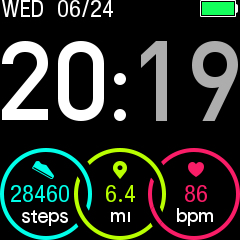
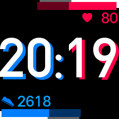
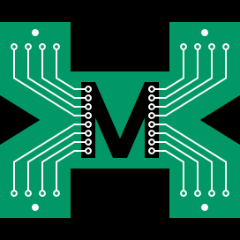

# Uwatch 2 Watchface Editor

Or soon to be one. This is my attempt to reverse engineer the binary file format of Umidigi Uwatch 2 smart watch. The file itself is mostly the list of graphical sprites (with 16bit 565 rgb colors), written with rle encoding, and the list of item positions on the screen. See decoder at `src/utils/parser.js` for now, until I write a better doc.

[Demo](https://uwatchfaces.kabbi.dev)

# TODO

- [ ] document watchface file format
- [ ] make proper watchface editor
- [ ] remove copyrighted binaries from repo